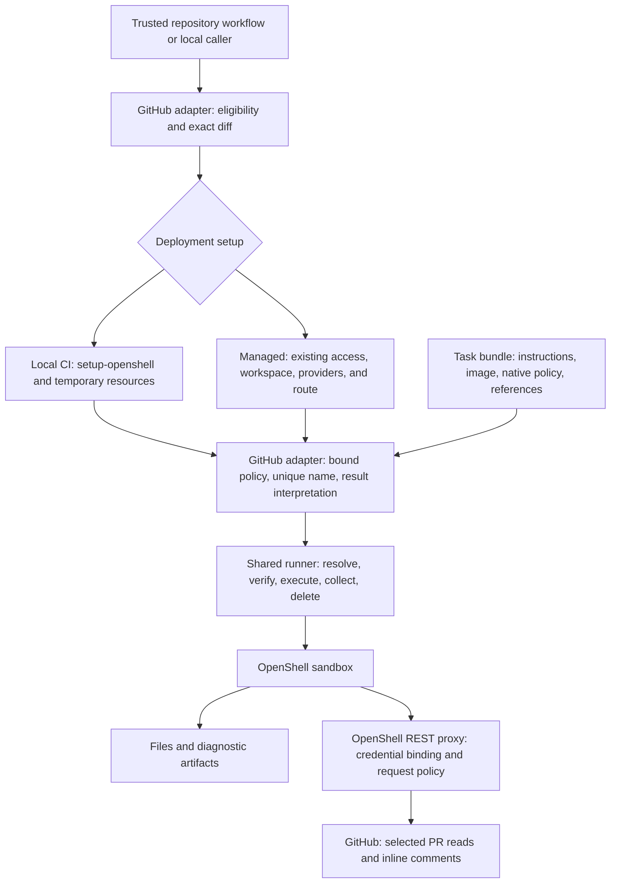

# GitHub review adapter

`harness github review` turns trusted GitHub review inputs into one sandbox
execution. The adapter lives here in Go; the CLI wiring lives in
`runner/cmd/github_review.go`. It calls the existing apply service in-process
through one execution function, without spawning another harness process or
parsing its console output. This is a task integration, not a plugin framework.



| Owner | Responsibility |
|---|---|
| GitHub Actions | Trusted checkout, scoped host token, trigger, concurrency, artifact retention, choosing setup |
| `scripts/pr-review-local.sh` | Temporary workspace, provider profile/instances, inference setup, and deletion of resources it created |
| This adapter | PR eligibility, exact head/base diff and checksum, caller skill containment, native policy rendering, bounded OpenCode output validation |
| Generic runner | Target resolution, provider reference checks, execution result, sandbox lifecycle, cancellation and downloads |
| Managed platform | Workspace membership, durable provider credential lifecycle, matching inference route and connectivity |
| Task bundle | Review behavior, agent configuration, image, policy template and provider metadata |

## Commands

Run from a trusted harness checkout after building the binary:

```bash
export REVIEW_REPOSITORY=owner/repository REVIEW_PR=123
export REVIEW_DIR="$PWD/review-123-new"
./harness github review prepare
./harness github review run --file path/to/trusted-review-workflow.yaml
```

The workflow uses the existing version 1 target, provider and inference fields.
The adapter does not invent a gateway default: flags, OpenShell environment,
workflow target and normal defaults retain their existing precedence. For a
direct registration, do not override it with `--gateway` or
`OPENSHELL_GATEWAY`. Host `gh` authentication supplies metadata reads; provider
credentials remain with OpenShell/platform setup.

`run` always requires an existing matching declared inference route. It fails
on missing/mismatched routes, unsupported reads, missing providers, or invalid
access before creating a sandbox. It never creates or deletes a workspace or
provider, and never writes an inference route. It rejects `sandbox.keep: true`
and `sandbox.tty: true` so this headless integration retains runner-owned cleanup.

`--github-provider NAME` binds the same existing provider name into the supplied
native policy template and `${REVIEW_GITHUB_PROVIDER}` task reference. The
provider must be endpointless, so its profile does not widen the task policy.
The gateway/platform, not the adapter, validates provider capabilities.

The default skill belongs to the pinned task bundle. `--skill FILE` accepts a
trusted local file; `--skill-root CHECKOUT --skill RELATIVE_FILE` additionally
rejects traversal and symlinks that escape the trusted caller checkout. Task
assets are resolved from the trusted checkout; PR content never supplies code,
config, or skill paths. A custom workflow must retain the OpenCode JSON event
protocol and review payload/environment contract of the supplied task.

For temporary local setup, use `scripts/pr-review-local.sh` instead of the
second command, with the GitHub App and short-lived Vertex bootstrap credentials.
The old `scripts/pr-review.sh prepare|run` entry point delegates for compatibility.

## Result and failure contract

Preparation creates a new private directory, validates opt-in and expected
head, fetches the exact base-to-head diff, limits it to 256 KiB, and records its
SHA-256 in `input.json`. Only successful eligible preparation sets the CI output
`eligible=true`. Run checks repository, PR, revisions and diff integrity again.
The checksum detects changes to the prepared diff; it is not a signature against
a compromised trusted host.

Run uses a random sandbox name, an eight-minute context deadline, and a 2 MiB
limit for each agent output stream. An output-limit breach cancels execution.
The runner writes `execution.json`, returns execution and cleanup errors, and
deletes the sandbox using a separate cleanup context. The adapter additionally
requires a valid OpenCode completion stream. Completed non-shell tools may
omit process exit codes; shell tools must provide one. A successful-looking final text
cannot hide a nonzero execution status or failed sandbox cleanup.

`review.txt` contains agent text; `summary.md` contains host-derived status and
revision only. `sandbox-name.txt` identifies the run for investigation. Local CI
also writes `local-setup.json`; a nonzero setup/teardown exit fails the Actions
step even if the sandbox review completed. No automatic retry is introduced.

Comments can be posted during execution. Eligibility is checked before and
after, not atomically before every comment; a skipped, cancelled or failed run
can already have produced permitted GitHub effects. Output validation checks
protocol completion, not finding quality or proof of publication. Normal
cancellation is covered; abrupt host loss and ambiguous sandbox creation remain
platform lifecycle concerns. Never blindly rerun to resolve uncertain effects.

## Scope and upstream replacement

The local script is a CI provisioning bridge, replaceable by platform bootstrap
when moving to a managed gateway. The Go adapter is GitHub review behavior;
OpenShell still owns credentials, proxy enforcement and execution. Native
provider profiles and existing SDK lifecycle replace custom implementations of
those concerns. No additional upstream workaround or credential manager is
introduced. If OpenShell later supplies equivalent review task orchestration,
this adapter can be retired independently of the task bundle.
